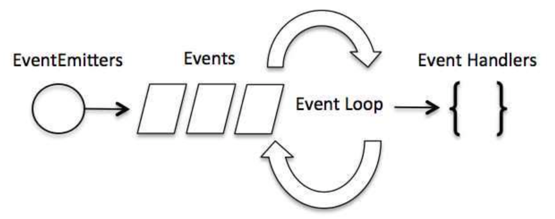

## 创建第一个应用

1. **引入 required 模块：**我们可以使用 **require** 指令来载入 Node.js 模块。

   ```javascript
   var http = require("http");
   ```

2. **创建服务器：**服务器可以监听客户端的请求，类似于 Apache 、Nginx 等 HTTP 服务器

   ```javascript
   var http = require('http');
   
   http.createServer(function (request, response) {
   
       // 发送 HTTP 头部 
       // HTTP 状态值: 200 : OK
       // 内容类型: text/plain
       response.writeHead(200, {'Content-Type': 'text/plain'});
   
       // 发送响应数据 "Hello World"
       response.end('Hello World\n');
   }).listen(8888);
   
   // 终端打印如下信息
   console.log('Server running at http://127.0.0.1:8888/');
   ```

3. **接收请求与响应请求** 服务器很容易创建，客户端可以使用浏览器或终端发送 HTTP 请求，服务器接收请求后返回响应数据。

   ## Node包管理工具-npm

   **使用淘宝镜像**

   ```javascript
   npm install -g cnpm --registry=https://registry.npmmirror.com
   ```

   ## Node.js REPL(交互式解析器)

- **读取** - 读取用户输入，解析输入的 Javascript 数据结构并存储在内存中。
- **执行** - 执行输入的数据结构
- **打印** - 输出结果
- **循环** - 循环操作以上步骤直到用户两次按下 **ctrl-c** 按钮退出。

## Node.js回调函数

Node.js 异步编程的直接体现就是回调。

异步编程依托于回调来实现，但不能说使用了回调后程序就异步化了。

回调函数在完成任务后就会被调用，Node 使用了大量的回调函数，Node 所有 API 都支持回调函数。

例如，我们可以一边读取文件，一边执行其他命令，在文件读取完成后，我们将文件内容作为回调函数的参数返回。这样在执行代码时就没有阻塞或等待文件 I/O 操作。这就大大提高了 Node.js 的性能，可以处理大量的并发请求。

回调函数一般作为函数的最后一个参数出现：

```javascript
function f1(name, age, callback) { }
function f2(value, callback1, callback2) { }
```

阻塞是按顺序执行的，而非阻塞是不需要按顺序的，所以如果需要处理回调函数的参数，我们就需要写在回调函数内。

## Node.js事件循环

- Node.js 是单进程单线程应用程序，但是因为 V8 引擎提供的异步执行回调接口，通过这些接口可以处理大量的并发，所以性能非常高。
- Node.js 几乎每一个 API 都是支持回调函数的。
- Node.js 基本上所有的事件机制都是用设计模式中观察者模式实现。
- Node.js 单线程类似进入一个while(true)的事件循环，直到没有事件观察者退出，每个异步事件都生成一个事件观察者，如果有事件发生就调用该回调函数.

