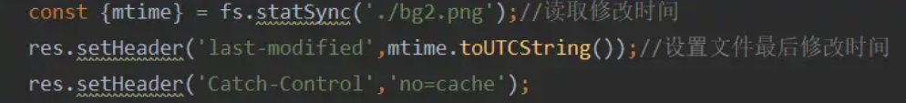

## Web的缓存机制

​		什么是web缓存？ 主要指浏览器缓存和http缓存，http缓存是web缓存的核心，为重要部分。

浏览器缓存：**localStorage**,**sessionStorage**,**cookie**。这些功能主要用于缓存一些必要的数据，比如用户信息。比如需要携带到后端的参数。亦或者是一些列表数据等等。

| 区别     | **localStorage**                  | sessionStorage                    | **cookie**     |
| -------- | --------------------------------- | --------------------------------- | -------------- |
| 缓存容量 | 5M                                | 5M                                | 4kb            |
| 缓存范围 | 可跨页面通讯                      | 不可跨页面通讯                    |                |
| 缓存时长 | 需手动清楚，否则一直在            | 关闭页面后自动清除                | 需设置过期时间 |
| 使用方式 | getItem, setItem,removeItem,clear | getItem, setItem,removeItem,clear |                |

#### 缓存解决的问题：

1. ​		减少不必要的网络传输，节约宽带，
2. ​		更快的加载页面，
3. ​		减少服务器负载，避免服务器过载

##### **http缓存又分为：强缓存和协商缓存**

###### 基于Cache-control实现的抢缓存（代替Expires的强缓存实现方法）

**Cache-controld的使用方法：**

```javascript
//往响应头中写入需要缓存的时间
res.writeHead(200,{
    'Cache-Control':'max-age=10'
});
```

- **max-age=N**决定客户端资源被缓存多久。N代表缓存时间代为为秒

- **s-maxage**决定代理服务器缓存的时长。

- **no-cache**表示是强制进行协商缓存。

- **no-store**是表示禁止任何缓存策略。

- **public**表示资源即可以被浏览器缓存也可以被代理服务器缓存。

- **private**表示资源只能被浏览器缓存。 （默认值）

  ###### 基于last-modified的协商缓存

  1. 首先需要在服务器端读出文件修改时间，
  2. 将读出来的修改时间赋给响应头的`last-modified`字段。
  3. 最后设置`Cache-control:no-cache`

  代码如下：

  

  ​    4.当客户端读取到`last-modified`的时候，会在下次的请求标头中携带一个字段:`If-Modified-Since`。

  ​		而这个请求头中的`If-Modified-Since`就是服务器第一次修改时候给他的时间，也就是上图中的

```javascript
res.setHeader('last-modified',mtime.toUTCString())
```

​		**那么之后每次对该资源的请求，都会带上`If-Modified-Since`这个字段，而务端就需要拿到这个时间并再次读取该资源的修改时间，让他们两个做一个比对来决定是读取缓存还是返回新的资源。**

​		**由于以上协商缓存是通过文件的修改时间来判断是否更改而产生的，那么当文件来回修改文件名时，文件内容没修改，儿缓存依然失效了，还有一种情况是文件修改时间的最小单位是秒，当文件在几百毫秒内完成修改，文件修改时间不会发生改变，即当文件内容修改了，依然不会返回新的文件。**

​		为解决上面两个问题，从http1.1新增了一个头信息，ETag（entity 实体标签）

ETag：将原先协商缓存的比较**时间戳**的形式修改成了比较**文件指纹（根据文件内容计算出的唯一哈希值。文件内容一旦改变则指纹改变）。

## As Total

- http缓存可以减少宽带流量，加快响应速度。
- 关于强缓存，`cache-control`是`Expires`的完全替代方案，在可以使用`cache-control`的情况下不要使用`expires`
- 关于协商缓存,`etag`并不是`last-modified`的完全替代方案，而是补充方案，具体用哪一个，取决于业务场景。
- 有些缓存是从磁盘读取，有些缓存是从内存读取，有什么区别？答：从内存读取的缓存更快。
- 所有带304的资源都是协商缓存，所有标注（从内存中读取/从磁盘中读取）的资源都是强缓存。


