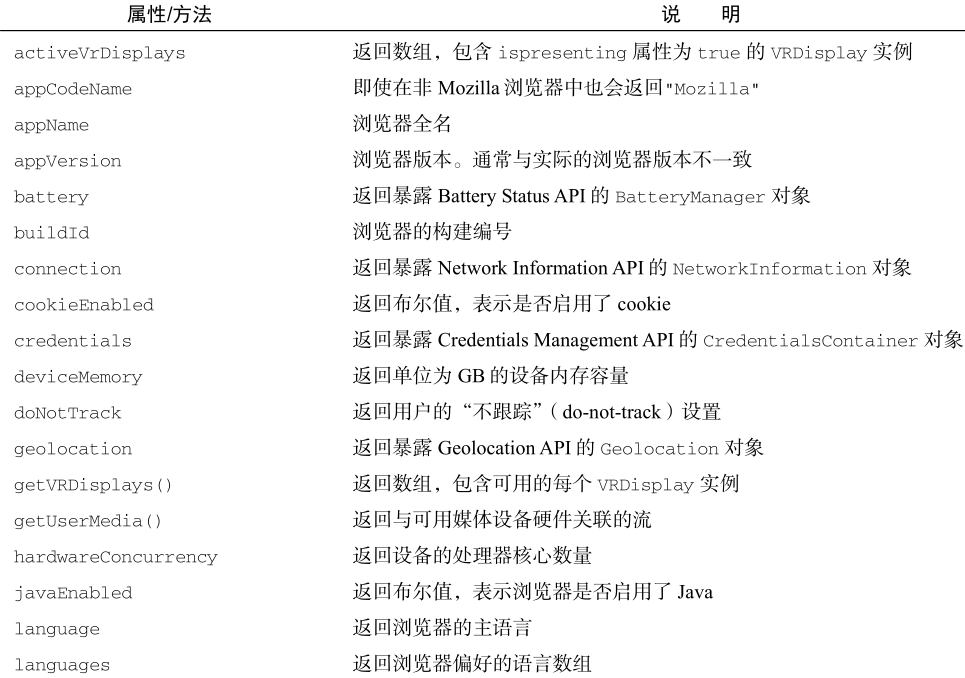
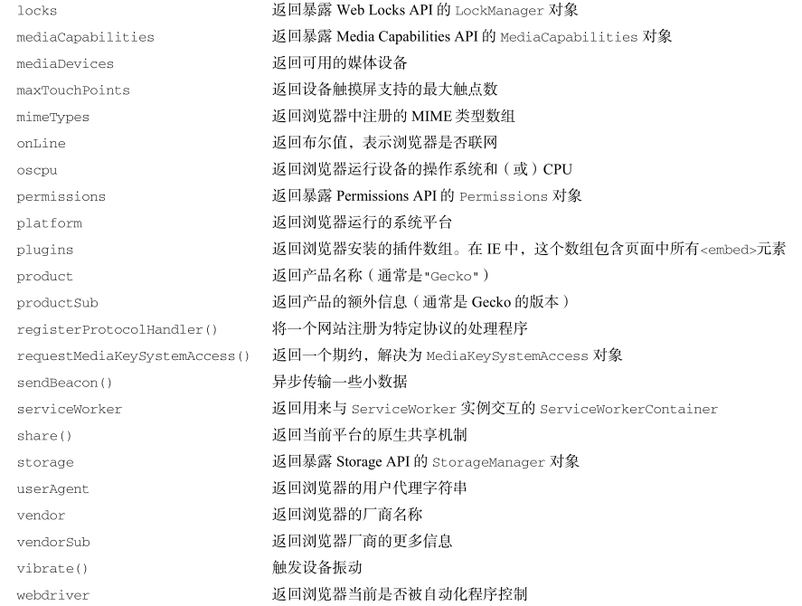
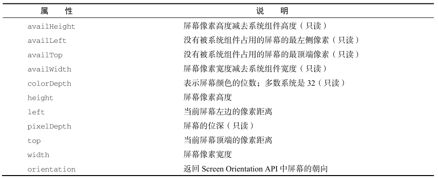

## Web的缓存机制

​		什么是web缓存？ 主要指浏览器缓存和http缓存，http缓存是web缓存的核心，为重要部分。

浏览器缓存：**localStorage**,**sessionStorage**,**cookie**。这些功能主要用于缓存一些必要的数据，比如用户信息。比如需要携带到后端的参数。亦或者是一些列表数据等等。

| 区别     | **localStorage**                  | sessionStorage                    | **cookie**     |
| -------- | --------------------------------- | --------------------------------- | -------------- |
| 缓存容量 | 5M                                | 5M                                | 4kb            |
| 缓存范围 | 可跨页面通讯                      | 不可跨页面通讯                    |                |
| 缓存时长 | 需手动清楚，否则一直在            | 关闭页面后自动清除                | 需设置过期时间 |
| 使用方式 | getItem, setItem,removeItem,clear | getItem, setItem,removeItem,clear |                |

### 缓存解决的问题：

1. ​		减少不必要的网络传输，节约宽带，
2. ​		更快的加载页面，
3. ​		减少服务器负载，避免服务器过载

##### **http缓存又分为：强缓存和协商缓存**

###### 基于Cache-control实现的抢缓存（代替Expires的强缓存实现方法）

**Cache-controld的使用方法：**

```javascript
//往响应头中写入需要缓存的时间
res.writeHead(200,{
    'Cache-Control':'max-age=10'
});
```

- **max-age=N**决定客户端资源被缓存多久。N代表缓存时间代为为秒

- **s-maxage**决定代理服务器缓存的时长。

- **no-cache**表示是强制进行协商缓存。

- **no-store**是表示禁止任何缓存策略。

- **public**表示资源即可以被浏览器缓存也可以被代理服务器缓存。

- **private**表示资源只能被浏览器缓存。 （默认值）

  ###### 基于last-modified的协商缓存

  1. 首先需要在服务器端读出文件修改时间，
  2. 将读出来的修改时间赋给响应头的`last-modified`字段。
  3. 最后设置`Cache-control:no-cache`

  代码如下：

  

  ​    4.当客户端读取到`last-modified`的时候，会在下次的请求标头中携带一个字段:`If-Modified-Since`。

  ​		而这个请求头中的`If-Modified-Since`就是服务器第一次修改时候给他的时间，也就是上图中的

```javascript
res.setHeader('last-modified',mtime.toUTCString())
```

​		**那么之后每次对该资源的请求，都会带上`If-Modified-Since`这个字段，而务端就需要拿到这个时间并再次读取该资源的修改时间，让他们两个做一个比对来决定是读取缓存还是返回新的资源。**

​		**由于以上协商缓存是通过文件的修改时间来判断是否更改而产生的，那么当文件来回修改文件名时，文件内容没修改，儿缓存依然失效了，还有一种情况是文件修改时间的最小单位是秒，当文件在几百毫秒内完成修改，文件修改时间不会发生改变，即当文件内容修改了，依然不会返回新的文件。**

​		为解决上面两个问题，从http1.1新增了一个头信息，ETag（entity 实体标签）

ETag：将原先协商缓存的比较**时间戳**的形式修改成了比较**文件指纹（根据文件内容计算出的唯一哈希值。文件内容一旦改变则指纹改变）。

### As Total

- http缓存可以减少宽带流量，加快响应速度。
- 关于强缓存，`cache-control`是`Expires`的完全替代方案，在可以使用`cache-control`的情况下不要使用`expires`
- 关于协商缓存,`etag`并不是`last-modified`的完全替代方案，而是补充方案，具体用哪一个，取决于业务场景。
- 有些缓存是从磁盘读取，有些缓存是从内存读取，有什么区别？答：从内存读取的缓存更快。
- 所有带304的资源都是协商缓存，所有标注（从内存中读取/从磁盘中读取）的资源都是强缓存。

## BOM的理解以及BOM对象有哪些？

`BOM` (Browser Object Model)，浏览器对象模型，提供了独立于内容与浏览器窗口进行交互的对象

1. Window：`Bom`的核心对象是`window`，它表示浏览器的一个实例

   在浏览器中，`window`对象有双重角色，即是浏览器窗口的一个接口，又是全局对象

   因此所有在全局作用域中声明的变量、函数都会变成`window`对象的属性和方法

   

2. Location：`location`属性描述如下：

   | **属性名** | 例子                                               | 说明                                |
   | ---------- | -------------------------------------------------- | ----------------------------------- |
   | hash       | "#contents"                                        | utl中#后面的字符，没有则返回空串    |
   | host       | www.wrox.com:80                                    | 服务器名称和端口号                  |
   | hostname   | www.wrox.com                                       | 域名，不带端口号                    |
   | href       | http://www.xxox.com:80/yale/?q=javascript#contents | 完整url                             |
   | pathname   | "/WileyCDA/"                                       | 服务器下面的文件路径                |
   | port       | 80                                                 | url的端口号，没有则为空             |
   | protocol   | http:                                              | 使用的协议                          |
   | search     | ?q=javascript                                      | url的查询字符串，通常为？后面的内容 |

   `location.reload()`，此方法可以重新刷新当前页面。这个方法会根据最有效的方式刷新页面，如果页面自上一次请求以来没有改变过，页面就会从浏览器缓存中重新加载

3. navigator：`navigator` 对象主要用来获取浏览器的属性，区分浏览器类型。属性较多，且兼容性比较复杂

   

   

4. screen:保存的纯粹是客户端能力信息，也就是浏览器窗口外面的客户端显示器的信息，比如像素宽度和像素高度

   

5. history

`history`对象主要用来操作浏览器`URL`的历史记录，可以通过参数向前，向后，或者向指定`URL`跳转

- ```history.go()```:接收一个整数数字或者字符串参数：向最近的一个记录中包含指定字符串的页面跳转，
- `history.forward()`：向前跳转一个页面
- `history.back()`：向后跳转一个页面
- `history.length`：获取历史记录数

## 常见的DOM操作

文档对象模型 (DOM) 是 `HTML` 和 `XML` 文档的编程接口

下面就来分析`DOM`常见的操作，主要分为：

- 创建节点：

创建新元素，接受一个参数，即要创建元素的标签名

```
const divEl = document.createElement("div");
```

创建一个文本节点

```
const textEl = document.createTextNode("content");
```

用来创建一个文档碎片，它表示一种轻量级的文档，主要是用来存储临时节点，然后把文档碎片的内容一次性添加到`DOM`中

```
const fragment = document.createDocumentFragment();
```

创建属性节点，可以是自定义属性

```
const dataAttribute = document.createAttribute('custom'); consle.log(dataAttribute);
```

- 查询节点：

### 获取节点

#### querySelector

传入任何有效的` css` 选择器，即可选中单个 `DOM `元素（首个）：

如果页面上没有指定的元素时，返回 `null`

#### querySelectorAll

返回一个包含节点子树内所有与之相匹配的`Element`节点列表，如果没有相匹配的，则返回一个空节点列表

- 更新节点

#### innerHTML

不但可以修改一个`DOM`节点的文本内容，还可以直接通过`HTML`片段修改`DOM`节点内部的子树

#### innerText、textContent

自动对字符串进行`HTML`编码，保证无法设置任何`HTML`标签

#### style

- 添加节点

#### appendChild

把一个子节点添加到父节点的最后一个子节点

#### innerHTML

如果这个DOM节点是空的，例如，`<div></div>`，那么，直接使用`innerHTML = '<span>child</span>'`就可以修改`DOM`节点的内容，相当于添加了新的`DOM`节点

#### insertBefore

#### setAttribute

在指定元素中添加一个属性节点，如果元素中已有该属性改变属性值

- 删除节点

删除一个节点，首先要获得该节点本身以及它的父节点，然后，调用父节点的`removeChild`把自己删掉

删除后的节点虽然不在文档树中了，但其实它还在内存中，可以随时再次被添加到别的位置